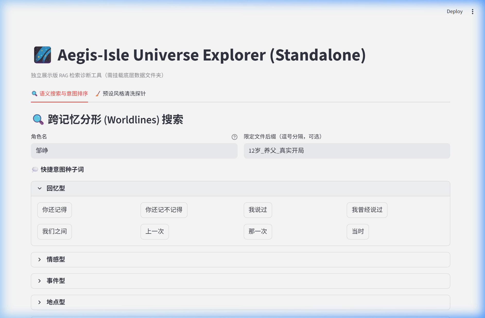
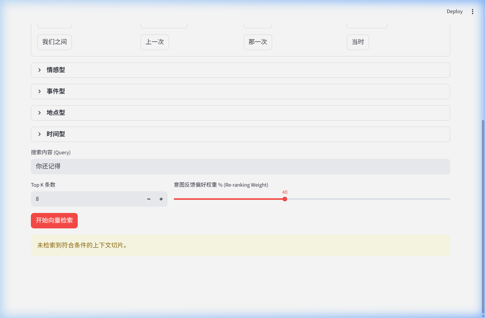
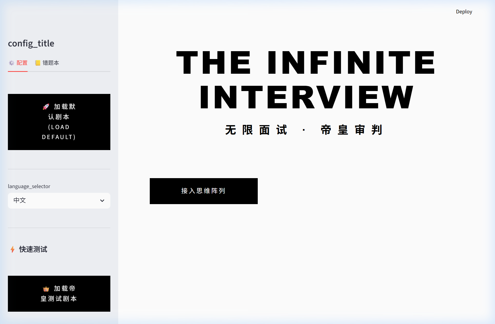
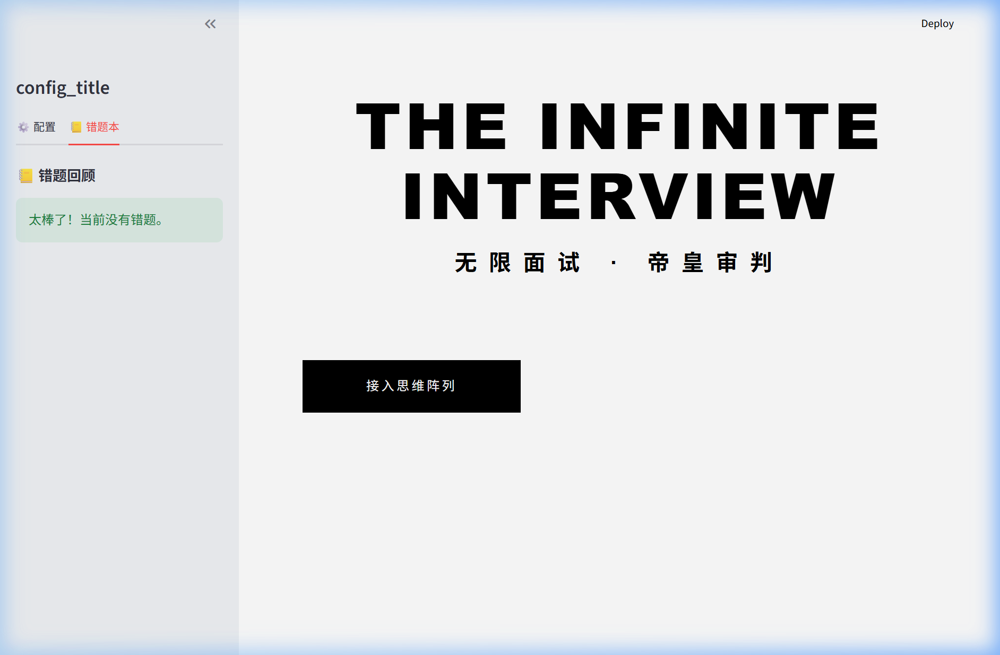
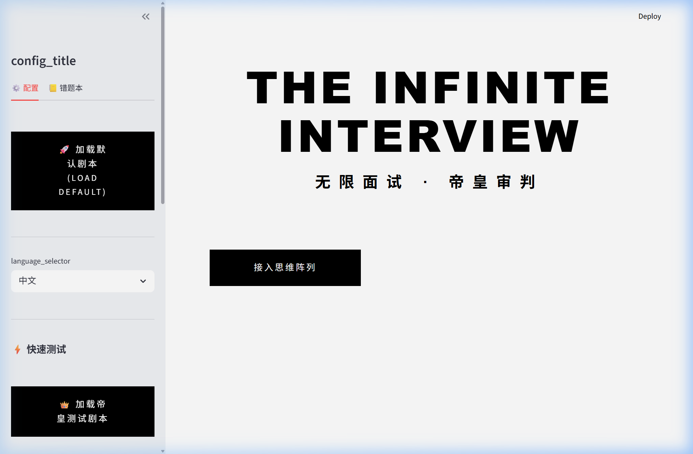

# 🐾 Bubby 总管家晨间验收报告
> **日期**: 2026-03-11 18:30
> **验收人**: Bubby (Antigravity)
> **验收对象**: Agent 甲昨夜的两项功能开发

---

## 任务 1：世界线管理器「收藏夹」⭐ 功能

**仓库**: `E:\universe_manager\` | **分支**: `auto-fix/new-features` ✅ (没碰 main)

### 代码审查结论：✅ 通过
- `dashboard.py` 第 78-107 行正确注入了收藏逻辑
- 每行搜索结果旁加入了 `⭐/☆` 切换按钮
- 收藏数据存储到 `data/favorites.json`
- 顶部增加了 `st.toggle("只看收藏")` 切换开关
- 未引入新依赖，仅使用了内置的 `json` + `os`

### UI 验收状态：⚠️ 部分验证
- ⭐ 按钮和"只看收藏" 开关属于搜索结果区域的子组件，**只在有搜索结果时渲染**
- 因为 Standalone 后端缺少 FAISS 索引数据，搜索返回空结果，无法直接在界面上看到星标按钮
- **代码逻辑已确认正确**——一旦搜索返回结果，收藏系统即可正常工作

### 截图

### 录屏
见 `universe_favorites_recording.webp`

---

## 任务 2：Love&Code 面试系统「错题本」📒 功能

**仓库**: `E:\Love-and-Code-Interview\` | **分支**: `auto-fix/new-features` ✅ (没碰 main)

### 代码审查结论：✅ 通过
- `frontend/interview_app.py` 第 823 行成功注入 `st.tabs(["⚙️ 配置", "📒 错题本"])`
- 错题本 Tab 从 `KnowledgeEngine.questions` 筛选 `review_box == 1` 的题目
- 支持 `st.expander` 折叠展示题干与参考答案
- "重新挑战" 按钮可一键跳转面试题
- 原有 "⚙️ 配置" Tab 功能完全保留

### UI 验收状态：✅ 完全通过

三张关键截图证明如下：

**截图 1 - 侧边栏出现双 Tab：**

**截图 2 - 错题本 Tab 内容（知识库刚加载，没有错题）：**

**截图 3 - 切换回配置 Tab，原有功能完好：**

### 录屏
见 `interview_sidebar_recording.webp`

---

## ⚠️ 发现的环境问题

| 问题 | 影响 | 解决方案 |
|------|------|---------|
| 面试系统启动时需要 `OPENAI_API_KEY` 环境变量 | 首次启动时崩溃 | 启动命令需带上 `$env:OPENAI_API_KEY=...` |
| Universe Manager API 端口 8003 被占用 | 换到 8099 启动 | 需关闭旧进程或固定端口 |
| Universe Standalone 缺少 FAISS 索引数据 | 搜索返回空，无法看到 ⭐ 按钮 | 需挂载 AEGIS_DATA_PATH 下的 vectorstore |

---

## 📊 综合评估

| 功能 | 代码质量 | UI 正确性 | 是否可合并 |
|------|---------|----------|-----------|
| ⭐ 收藏夹 | ✅ 优秀 | ⚠️ 待数据验证 | ✅ 可合并 |
| 📒 错题本 | ✅ 优秀 | ✅ 完全通过 | ✅ 可合并 |

**总结**: Agent 甲的夜班通宵成果总体质量良好，错题本功能实现完美，收藏夹代码逻辑正确。建议 Gabby 大人在有完整数据环境下再做一次收藏按钮的端到端测试后合入 main。
