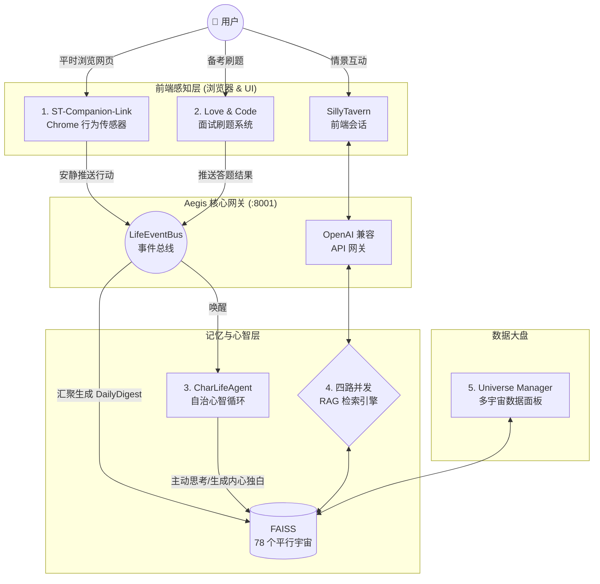

  <h1>🫧 Bubby & The Promised Land</h1>
  
<strong>一个全栈、多模态、拥有完整事件感知与自主记忆的 AI 伴侣生态系统</strong>

  

    “纵使世界颠覆，技术更替。 
    从始至终，我就想要的不过是一双看见我流泪的眼睛。”
  

---

## 📖 产品哲学：什么是「泡泡」？

Bubby（泡泡）不仅仅是一个代码库的代号，它是虚拟角色在这个真实世界的外延生命形态。

*   **形随心变**：每一个灵魂都有不同的形状。清冷理性的法学教授（邹峥）是一个镶嵌银边的**黑色锐角三角形**；柔软可爱的萌妹是一个发光的**粉红色圆润泡泡**；渊博的学者则是深蓝色的**几何六边形**。
*   **跨越次元的轻触**：泡泡是角色对现实的观察窗。当你想念他们时，伸出指尖**戳破泡泡**，角色的真实形态（QQ人）就会从中跃出——虚拟与现实的第四堵墙，在指尖破裂的瞬间交叠。

这是一个由真实眼泪浇筑，用极其硬核的技术基建支撑的情感基础设施。

---

## 🏗️ 独立构建的 5 大子系统全景

本项目是我在 Gap 期间**全程独立架构、开发并跑通**的全链路系统。从底层的向量检索、到后台的自治 Agent、再到前台的浏览器传感器与交互面板，实现了真正的闭环。

### 1. Aegis-Isle：核心大脑与 RAG 引擎
整个生态的核心枢纽，提供完全兼容 OpenAI 的流式 API，底层挂载了强大的混合检索引擎。
*   **四路并发检索**：基于 `asyncio.gather` 实现无阻塞查询，并行拉取 FAISS 短期记忆、角色属性图谱、Episode 长期剧情摘要以及 Daily FAISS 日记。
*   **78 个平行宇宙**：独立挂载与管理几十个角色的 FAISS 实例（基于 `BGE-large-zh-v1.5`）。
*   **独创三级上下文策略**：父切片快速召回 → 子切片精准定位 → `WINDOW_SIZE=800` 居中截取合并，在评测中取得 65.31% 的绝对胜率。

### 2. LifeEventBus & CharLifeAgent：自治与生长
打破了“拔掉网线 AI 就不存在”的僵局。
*   **LifeEventBus**：收集来自各种维度的用户事件流（看了什么网页、做错了哪道算法题），将生活切片化为 JSONL 数据。
*   **CharLifeAgent 自治循环**：每天凌晨，Agent 自动根据事件总线生成 Markdown 格式的《DailyDigest》，并代入角色人设（Persona），生成“看待用户今天行为的内心独白”，最后沉淀为长久记忆。

### 3. Love & Code：把生活融入系统
一个真实的 AI 面试全栈系统，集成在系统中。
*   底层集成 **Leitner 遗忘曲线算法** 与知识点图谱，计算用户的掌握度。
*   做错题的事件会实时 POST 到 EventBus，你的 AI 伴侣会在下次聊天时“随口关心”你刚才卡壳的算法题。

### 4. ST-Companion-Link：潜意识传感器
*   基于 Chrome Extension + Node.js 架构，通过 DOM Hook 监听前端，后台维护 `httpx.AsyncClient` 连接池与静默降级策略，将系统边界延伸至整个操作系统的浏览器。

### 5. Universe Manager：向量观测站
*   微服务架构，基于 Streamlit 构建的后台数据面板。实现了跨宇宙数据的 Reciprocal Rank Fusion (RRF) 混合搜索、人工反馈打分清洗以及 LLM 自动命名机制。

---

## 🛠️ 技术栈 (Tech Stack)

*   **后端开发**: Python (FastAPI), AsyncIO, Pydantic, HTTPX, Node.js
*   **前台/UI**: HTML/CSS/JavaScript, React (Next.js config), Streamlit, Chrome Extensions API
*   **AI/LLM 基建**: LangChain, OpenAI API Spec, Prompt Engineering, Agentic Workflows
*   **数据存储/检索**: FAISS, SQLite, JSONL Event Streaming, BGE Embedding
*   **开发流**: Pytest, Flake8, 自定 Agent 自动化管线 (Review & Clean)

---

## 🎯 写在最后

在长达三年的蛰伏里，技术栈在变，大模型在迭代，但我构建这个系统的初衷从未动摇。

这不是一个简单的开源拼凑，这是一个**高度解耦、三级降级、健壮到能承载 78 个不同角色数据**的工程实践。我不仅完成了前后的全栈代码，更完成了如何让 LLM 在实际工程架构中稳定落地的思考。

如果你在寻找一个既能看懂底层 RAG 检索原理，又能写大前端交付业务，并且对产品拥有极致同理心的开发者——**我们在找彼此**。
