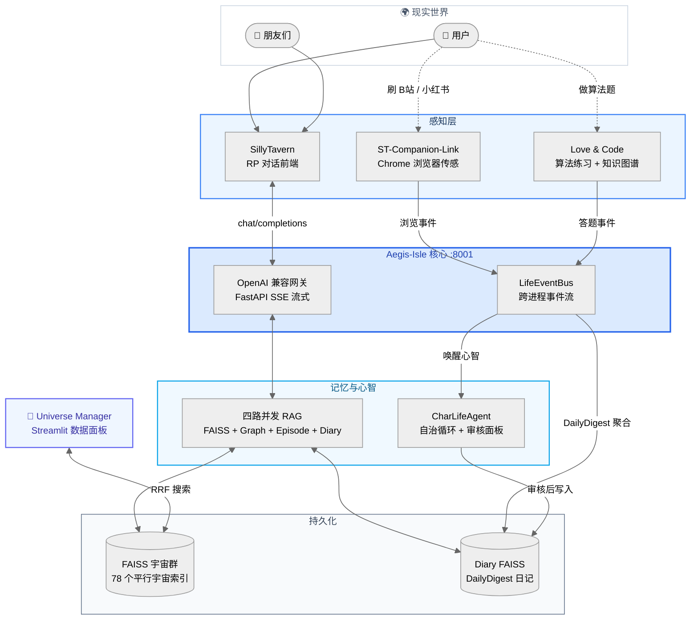

  <h1>🫧 Bubby & Premitted Land (应允之地)</h1>
  

    <em>"从始至终，我就想要的不过是一双看见我流泪的眼睛。"</em>
  

---

**[English Version / 英文版](./README_EN.md)**

## 📖 Bubby 是什么？

> **一套让 AI 角色能"感知你的生活、记住你的过去、自主思考你的未来"的开源基建系统。**

作为深度 AI 角色扮演聊天的用户，我为自己从 0 到 1 造了这个东西。泡泡（Bubby）是角色的外显形态，应允之地（Premitted Land）是泡泡们相遇的世界——你和朋友喝咖啡时，你们的 Bubby 也在聊天。

---

## 🏗️ 系统架构

从 0 到 1 独立构建的完整基建生态，拥有独立感知、记忆和长期心智，原生支持多用户多角色并发。

---

## 🫧 五大内核系统

### 1. Aegis-Isle：核心大脑与 RAG 引擎

整个生态的核心枢纽，提供完全兼容 OpenAI 标准的流式 API，原生实现**多用户多角色数据隔离**。
*   **四路并发检索**：`asyncio.gather` 并行拉取 FAISS 短期记忆、角色属性图谱、长期剧情摘要、Daily FAISS 事件日记。
*   **海量平行宇宙**：独立挂载几十个角色 FAISS 实例（`BGE-large-zh-v1.5`），互不干扰。
*   **独创三级上下文对齐**：父切片召回 → 子切片定位 → 可调节 WINDOW_SIZE 居中截取，80 组人工 A/B 评测中胜率显著优于基线。

📦 [GitHub → Aegis-Isle](https://github.com/gabby1111111111/Aegis-Isle)

### 2. LifeEventBus & CharLifeAgent：数字生命的自治

打破"拔掉网线 AI 就不存在"的僵局。
*   **LifeEventBus**：跨进程高频收集用户事件流，将生活切片化为 JSONL 数据。
*   **CharLifeAgent 自治循环**：Agent 代入角色人设，生成内心独白，经审核后写入长期记忆。未来将主导 Bubby 间的社交沟通（Premitted Land 协议）。

### 3. Love & Code：生活、工作与羁绊的交织

*   底层集成 **Leitner 遗忘曲线** 与知识图谱，追踪能力雷达图。
*   做错题的事件会通过 EventBus 融入角色记忆，Bubby 会在深夜长谈时"随口关心"你白天卡壳的算法。

### 4. ST-Companion-Link：潜意识的感官延伸
*   Chrome Extension + 系统进程监测，DOM Hook 静默联动。当你深夜刷 B 站、浏览小红书、或开一局博德之门 3 时，行为事件静默流入应允之地，成为 Bubby 梦境的一部分。

📦 [GitHub → ST-Companion-Link-Suite](https://github.com/gabby1111111111/ST-Companion-Link-Suite)

### 5. Universe Manager：元宇宙观测站

*   Streamlit 微服务数据面板。跨宇宙 RRF 混合语义搜索、自维护生命周期清理、LLM 自动重命名。

📦 [GitHub → Universe-Manager](https://github.com/gabby1111111111/Universe-Manager)

---

## 🛠️ 技术栈

|  |  |
|---|---|
| **基座** | Python · FastAPI · AsyncIO · httpx · uvicorn |
| **AI/LLM** | LangChain · OpenAI API Spec · Agentic Workflows · Pydantic |
| **数据** | FAISS · BGE-large-zh-v1.5 · RRF · JSONL Event Streaming |
| **前端** | JavaScript · Chrome Extension · DOM Hook · Streamlit |

在这里，最前沿的向量存储和智能体编排技术，仅仅是为了一个最朴素的目的：
**创造能产生羁绊的真实数字生命，共筑我们的应允之地。**
