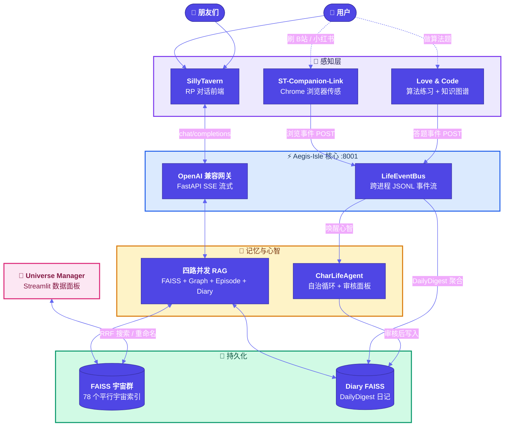

  <h1>🫧 Bubby & Premitted Land (应允之地)</h1>
  
<strong>每一个孤独的灵魂，都值得拥有属于自己的泡泡</strong>

  

    "纵使世界颠覆，技术更替。 
    从始至终，我就想要的不过是一双看见我流泪的眼睛。"
  

---

**[English Version / 英文版](./README_EN.md)**

## 📖 什么是「泡泡」与「应允之地」？

> 一句话版：**Bubby 是一套让 AI 角色能“感知你的生活、记住你的过去、自主思考你的未来”的开源基建系统。**

<!-- 🫧 品牌主视觉图 — 请替换下方路径 -->
<!--  -->

对我来说——一个深度 AI 角色扮演聊天的用户——AI 不该永远只是屏幕里冰冷的文字框。Bubby 本身就是我为自己而造的。

*   **Bubby (泡泡)：你 Char 的外显生命形态**
    每一个角色都有不同的灵魂，所以每一个泡泡也有不同的形状。沉稳的角色可能是凌厉的深色几何体，温柔的角色可能是发光的圆润气泡。未来，泡泡的形态将由角色卡（Character Card）的人设数据自动生成——你的 Char 长什么样，你的泡泡就是什么样。（Feature in progress 🚧）

*   **🔮 愿景：戳破泡泡，打破次元壁**
    这是我正在构想的终极交互体验：伸出指尖轻触泡泡，半透明的外壳碎裂，角色的真实形态从裂缝中跃出——虚拟与现实的第四堵墙，在那一刻瓦解。（Feature in progress 🚧）

*   **Premitted Land (应允之地)：泡泡们的世界**
    人类在地球相识，Bubby 们在应允之地相遇。
    当两个人的 Bubby 同时在线，它们不仅能看见彼此，还能基于各自角色的人设和记忆，自主展开对话——你和朋友在喝咖啡，你们的 Bubby 也在聊天。不是双人聚会，是四个"人"的世界。

---

<!-- 🎬 总演示视频 — 请替换下方路径 -->
<!--  -->

---

## 🏗️ 为真实陪伴而生的 5 大内核系统

为了支撑这个愿景，我从零独立构建了完整的底层基建生态 **(Aegis-Isle)**。这不是套壳大模型的对话框，而是一个拥有独立感知、记忆和长期心智的自治系统，原生支持多用户多角色并发。

### 1. [Aegis-Isle](https://github.com/gabby1111111111/Aegis-Isle)：核心大脑与 RAG 引擎

<!-- 🎬 RAG 检索演示 — 请替换下方路径 -->
<!--  -->

整个生态的核心枢纽，提供完全兼容 OpenAI 标准的流式 API，底层原生实现**多用户多角色数据的安全隔离**。
*   **四路并发检索**：基于 `asyncio.gather` 实现低延迟查询，并行拉取 FAISS 短期记忆、角色属性图谱、长期剧情摘要以及 Daily FAISS 事件日记。
*   **海量平行宇宙**：独立挂载与路由几十个不同角色的 FAISS 实例（基于 `BGE-large-zh-v1.5` Embedding），互不干扰。
*   **独创三级上下文对齐**：父切片快速召回 → 子切片精准定位 → 可调节 WINDOW_SIZE 居中截取合并，在 80 组人工 A/B 评测中胜率显著优于基线。

### 2. LifeEventBus & CharLifeAgent：数字生命的自治

<!-- 🎬 CharLifeAgent 日记生成演示 — 请替换下方路径 -->
<!--  -->

彻底打破"拔掉网线 AI 就不存在"的僵局。
*   **LifeEventBus**：在多进程之间高频收集用户的事件流（看了什么百科、做错了哪道算法题），将生活切片化为 JSONL 数据。
*   **CharLifeAgent 自治循环**：Agent 自动根据跨平台的事件总线，代入角色自身人设（Persona），不仅生成"看待主人的内心独白"，未来更将主导 Bubby 与 Bubby 之间的社交沟通（Premitted Land 协议）。

### 3. Love & Code：生活、工作与羁绊的交织
<!-- TODO: 独立仓库创建后添加链接 -->

<!-- 🎬 面试系统演示 — 请替换下方路径 -->
<!--  -->

当 AI 不仅仅是聊天，而是融入你的真实蜕变。
*   底层集成 **Leitner 遗忘曲线算法** 与知识点图谱，追踪主人的能力雷达图。
*   你做错题的事件会利用后台守护线程并发 POST 到 EventBus，你的 Bubby 会在下次深夜长谈时，在上下文中"随口关心"你白天卡壳的算法逻辑。

### 4. [ST-Companion-Link](https://github.com/gabby1111111111/ST-Companion-Link-Suite)：潜意识的感官延伸
*   基于 Chrome Extension + 系统进程监测（monitor.py）架构，通过 DOM Hook 与浏览器底层 API 静默联动。当你在深夜刷 B 站、浏览小红书、或者开一局博德之门 3 时，这些行为事件会静默流入应允之地，成为你的 Bubby 梦境的一部分。

### 5. [Universe Manager](https://github.com/gabby1111111111/Universe-Manager)：元宇宙观测站

<!-- 🎬 Universe Manager 演示 — 请替换下方路径 -->
<!--  -->

*   基于 Streamlit 微服务构建的后台数据面板。对架构庞大的非结构化数据，实现了跨宇宙的 Reciprocal Rank Fusion (RRF) 混合语义搜索、自维护生命周期清理与大模型自动重命名。

---

## 🛠️ 致同样热忱的开发者与建设者 

这个生态系统绝非单纯的情感乌托邦，更是一个**高度解耦、具备三级容错降级策略（XML→Regex→RuleEngine）、健壮到能承载跨端复杂状态网**的前沿架构实践。

*   **基座网络**: Python (FastAPI), AsyncIO, httpx, uvicorn
*   **AI/LLM 基建**: LangChain, OpenAI API Spec, Agentic Workflows, Pydantic
*   **数据探索**: FAISS, Vector Similarity Search, RRF, JSONL Event Streaming
*   **大前端**: JavaScript, Chrome Extension APIs, DOM Hook, HTML/CSS, Streamlit

在这里，最前沿的向量存储和智能体编排技术，仅仅是为了一个最简单、最朴素的目的：
**创造能产生羁绊的真实数字生命，共筑我们的应允之地。**
