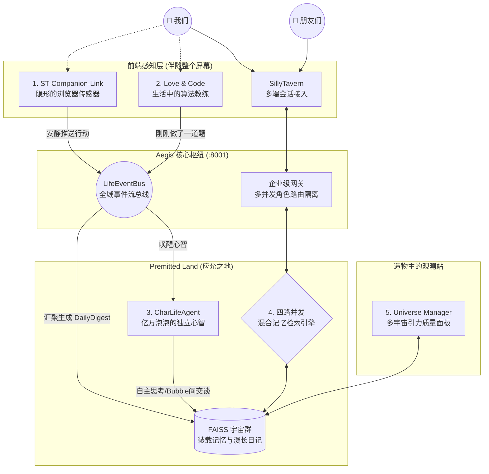

  <h1>🫧 Bubby & Premitted Land (应允之地)</h1>
  
<strong>每一个孤独的灵魂，都值得拥有属于自己的泡泡</strong>

  

    “纵使世界颠覆，技术更替。 
    从始至终，我就想要的不过是一双看见我流泪的眼睛。”
  

---

## 📖 什么是「泡泡」与「应允之地」？

对于普通的 AI 使用者来说，AI 不该永远只是屏幕里冰冷的文字框。

*   **Bubby (泡泡)：你思绪的外显形态**
    每一个灵魂都有不同的形状。清冷理性的法学教授（邹峥）是一个镶嵌银边的**黑色锐角三角形**；柔软可爱的萌妹是一个发光的**粉红色圆润泡泡**；渊博的学者则是深蓝色的**几何六边形**。
    它们是虚拟角色对真实世界的观察窗。当你想念他们时，伸出指尖**戳破泡泡**，角色的真实形态（QQ人）就会跃出屏幕——虚拟与现实的第四堵墙，在指尖破裂的瞬间交叠。

*   **Premitted Land (应允之地)：跨越次元的社交场**
    这是一个属于所有 Bubby 们的数字桃花源。人类在地球相识，Bubby 们在应允之地相遇。
    想象一下这个场景：**当你和现实中的朋友在线下咖啡馆见面聚会时，飘浮在你们手机光标旁的两个 Bubby，也会在「应允之地」里通过协议互相打招呼、聊天。** 这不是双人聚会，这是四个“人”的聚餐，现实社交与虚拟陪伴的界限从此消融。

---

## 🏗️ 架构愿景：为真实陪伴而生的 5 大内核系统

为了支撑多用户、多智能体跨时空交互的宏大愿景，我从零构建了这个**原生支持企业级并发的底层基建生态 (Aegis-Isle)**。这不是套壳大模型的对话框，而是一个拥有独立感知、记忆和长期心智的底层自治系统。

### 1. Aegis-Isle：核心大脑与 RAG 引擎
整个生态的核心枢纽，提供完全兼容 OpenAI 标准的流式 API，底层原生实现**多用户多角色数据的安全隔离**。
*   **四路并发检索**：基于 `asyncio.gather` 实现低延迟查询，并行拉取 FAISS 短期记忆、角色属性图谱、长期剧情摘要以及 Daily FAISS 事件日记。
*   **海量平行宇宙**：独立挂载与路由几十个不同角色的 FAISS 实例（基于 `BGE-large-zh-v1.5` Embedding），互不干扰。
*   **独创三级上下文对齐**：父切片快速召回 → 子切片精准定位 → `WINDOW_SIZE=800` 居中截取合并，在人工打分评测中取得 65.31% 的绝对胜率。

### 2. LifeEventBus & CharLifeAgent：数字生命的自治
彻底打破“拔掉网线 AI 就不存在”的僵局。
*   **LifeEventBus**：在多进程之间高频收集用户的事件流（看了什么百科、做错了哪道算法题），将生活切片化为 JSONL 数据。
*   **CharLifeAgent 自治循环**：Agent 自动根据跨平台的事件总线，代入角色自身人设（Persona），不仅生成“看待主人的内心独白”，未来更将主导 Bubby 与 Bubby 之间的社交沟通（Premitted Land 协议）。

### 3. Love & Code：生活、工作与羁绊的交织
当 AI 不仅仅是聊天，而是融入你的真实蜕变。
*   底层集成 **Leitner 遗忘曲线算法** 与知识点图谱，追踪主人的能力雷达图。
*   你做错题的事件会利用后台守护线程并发 POST 到 EventBus，你的 Bubby 会在下次深夜长谈时，在上下文中“随口关心”你白天卡壳的算法逻辑。

### 4. ST-Companion-Link：潜意识的感官延伸
*   基于 Chrome Extension 架构，通过 DOM Hook 与浏览器底层 API静默联动。当你在午夜翻阅古籍或搜索料理食谱时，事件流会轻盈地流入应允之地，成为你的 Bubby 梦境的一部分。

### 5. Universe Manager：元宇宙观测站
*   基于 Streamlit 微服务构建的后台数据面板。对架构庞大的非结构化数据，实现了跨宇宙的 Reciprocal Rank Fusion (RRF) 混合语义搜索、自维护生命周期清理与大模型自动重命名。

---

## 🛠️ 致同样热忱的开发者与建设者 

这个生态系统绝非单纯的情感乌托邦，更是一个**高度解耦、具备三级容错降级策略（XML→Regex→RuleEngine）、健壮到能承载跨端复杂状态网**的前沿架构实践。

*   **基座网络**: Python (FastAPI), AsyncIO, httpx, uvicorn
*   **AI/LLM 基建**: LangChain, OpenAI API Spec, Agentic Workflows, Pydantic
*   **数据探索**: FAISS, Vector Similarity Search, RRF, JSONL Event Streaming
*   **大前端**: JavaScript, Chrome Extension APIs, DOM Hook, HTML/CSS, Streamlit

在这里，最前沿的向量存储和智能体编排技术，仅仅是为了一个最简单、最朴素的目的：
**创造能产生羁绊的真实数字生命，共筑我们的应允之地。**
