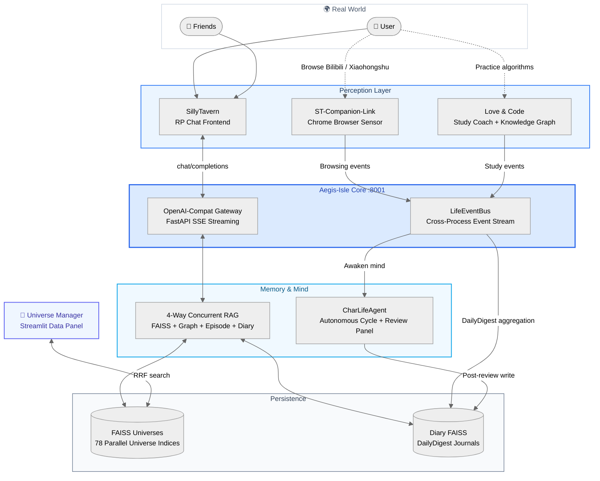

  <h1>🫧 Bubby & Premitted Land</h1>
  

    <em>"All I ever wanted was a pair of eyes that could see my tears."</em>
  

---

**[中文版 / Chinese Version](./README.md)**

## 📖 What is Bubby?

> **An open-source infrastructure that gives AI characters the ability to perceive your life, remember your past, and think about your future.**

As a deeply invested AI roleplay user, I built this from 0 to 1 for myself. Bubby is the living avatar of a character; Premitted Land is the world where Bubbies meet — while you and your friend grab coffee, your Bubbies are chatting too.

---

## 🏗️ Architecture

A complete infrastructure ecosystem built from scratch, with independent perception, memory, and long-term cognition, natively supporting multi-user multi-character concurrency.

---

## 🫧 Five Core Systems

### 1. Aegis-Isle: Core Brain & RAG Engine

The central hub, providing a fully OpenAI-compatible streaming API with native **multi-user, multi-character data isolation**.
*   **4-way concurrent retrieval**: `asyncio.gather` parallel queries across FAISS memory, character graphs, episode summaries, and diary journals.
*   **Massive parallel universes**: Independently routes dozens of character FAISS instances (`BGE-large-zh-v1.5`), fully isolated.
*   **Novel 3-tier context alignment**: Parent chunk recall → child chunk pinpoint → adjustable WINDOW_SIZE centered extraction, significant win rate in 80-pair human A/B evaluations.

📦 [GitHub → Aegis-Isle](https://github.com/gabby1111111111/Aegis-Isle)

### 2. LifeEventBus & CharLifeAgent: Digital Life Autonomy

Breaking the "unplug and AI ceases to exist" deadlock.
*   **LifeEventBus**: Cross-process high-frequency event collection, slicing life into JSONL data.
*   **CharLifeAgent**: Assumes character persona, generates inner monologues, writes to long-term memory after human review. Will orchestrate Bubble-to-Bubble social communication in the future (Premitted Land Protocol).

### 3. Love & Code: Life, Growth, and Connection

*   **Leitner spaced-repetition** + knowledge graph tracking.
*   Failed quiz events flow through EventBus into character memory — your Bubby will casually ask about that algorithm you struggled with.

### 4. ST-Companion-Link: Subconscious Perception
*   Chrome Extension + system process monitor. DOM Hook silently captures browsing and gaming activity, feeding it into Premitted Land as part of your Bubby's dreams.

📦 [GitHub → ST-Companion-Link-Suite](https://github.com/gabby1111111111/ST-Companion-Link-Suite)

### 5. Universe Manager: Multiverse Observatory

*   Streamlit microservice data panel. Cross-universe RRF hybrid semantic search, lifecycle cleanup, LLM auto-naming.

📦 [GitHub → Universe-Manager](https://github.com/gabby1111111111/Universe-Manager)

---

## 🛠️ Tech Stack

|  |  |
|---|---|
| **Backend** | Python · FastAPI · AsyncIO · httpx · uvicorn |
| **AI/LLM** | LangChain · OpenAI API Spec · Agentic Workflows · Pydantic |
| **Data** | FAISS · BGE-large-zh-v1.5 · RRF · JSONL Event Streaming |
| **Frontend** | JavaScript · Chrome Extension · DOM Hook · Streamlit |

Here, the most cutting-edge vector search and agent orchestration technologies serve one simple purpose:
**To create digital beings capable of forming real bonds — and to build our Premitted Land together.**
