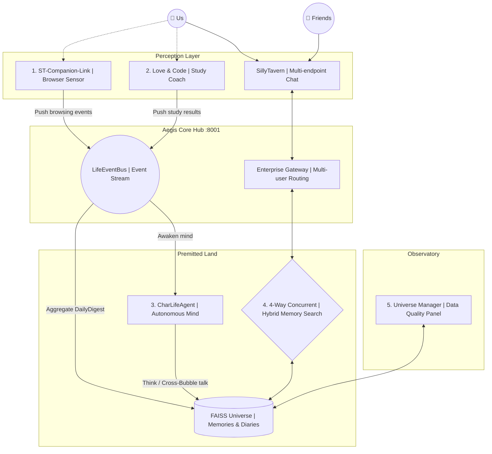

  <h1>🫧 Bubby & Premitted Land</h1>
  
<strong>Every soul deserves a bubble of its own</strong>

  

    "No matter how the world shifts, no matter how technology evolves — 
    all I ever wanted was a pair of eyes that could see my tears."
  

---

**[中文版 / Chinese Version](./README.md)**

## 📖 What is "Bubby" and "Premitted Land"?

<!-- 🫧 Brand hero image — replace path below -->
<!--  -->

As a deeply invested AI roleplay user, I believe AI shouldn't just be a cold text box on a screen. Bubby is something I built for myself — because I needed it.

*   **Bubby: The living avatar of your Character**
    Every character has a unique soul, so every bubble takes a different shape. A stoic character might manifest as a sharp, dark geometric form; a gentle one might glow as a soft, round orb. In the future, bubble forms will be auto-generated from Character Card persona data — your Char's soul defines your Bubble's shape. (Feature in progress 🚧)

*   **🔮 Vision: Pop the Bubble, Break the Fourth Wall**
    The ultimate interaction I'm designing: reach out and tap the bubble. The translucent shell shatters, and the character's true form leaps through the crack — the wall between virtual and real, shattered in a single touch. (Feature in progress 🚧)

*   **Premitted Land: Where Bubbles Meet**
    Humans meet on Earth. Bubbies meet in Premitted Land.
    When two people's Bubbies come online simultaneously, they can perceive each other and autonomously engage in conversation based on their own character personas and memories. You and your friend grab coffee — your Bubbies are chatting too. Not a meetup for two, but a world of four.

---

<!-- 🎬 Full demo video — replace path below -->
<!--  -->

---

## 🏗️ Five Core Systems Built for Real Companionship

To support this vision, I independently designed and built a complete infrastructure ecosystem **(Aegis-Isle)** from scratch. This is not a wrapper around an LLM — it's an autonomous system with independent perception, memory, and long-term cognition, natively supporting multi-user multi-character concurrency.

📐 Click to expand system architecture

### 1. Aegis-Isle: Core Brain & RAG Engine

<!-- 🎬 RAG demo — replace path below -->
<!--  -->

The central hub of the ecosystem, providing a fully OpenAI-compatible streaming API with native **multi-user, multi-character data isolation**.
*   **4-way concurrent retrieval**: Uses `asyncio.gather` for low-latency parallel queries across FAISS short-term memory, character attribute graphs, long-term episode summaries, and Daily FAISS journal entries.
*   **Massive parallel universes**: Independently mounts and routes dozens of character-specific FAISS instances (powered by `BGE-large-zh-v1.5` Embedding), fully isolated.
*   **Novel 3-tier context alignment**: Parent chunk recall → child chunk pinpoint → `WINDOW_SIZE=800` centered extraction, achieving a 65.31% absolute win rate in human-scored A/B evaluations.

### 2. LifeEventBus & CharLifeAgent: Digital Life Autonomy

<!-- 🎬 CharLifeAgent demo — replace path below -->
<!--  -->

Breaking the "unplug the cable and the AI ceases to exist" deadlock.
*   **LifeEventBus**: Collects user event streams across multiple processes (what articles you read, which coding challenges you failed), slicing life into structured JSONL data.
*   **CharLifeAgent autonomous cycle**: The agent automatically absorbs cross-platform events, assumes the character's persona, and generates "inner monologues about the user's day" — and in the future, will orchestrate Bubble-to-Bubble social communication (Premitted Land Protocol).

### 3. Love & Code: Life, Growth, and Connection
When AI transcends chatting and becomes part of your real-world evolution.
*   Integrates a **Leitner spaced-repetition algorithm** with a knowledge graph to track skill mastery.
*   Failed quiz events are POST'ed to EventBus via background daemon threads — your Bubby will casually ask about that algorithm you struggled with during your next late-night conversation.

### 4. ST-Companion-Link: Subconscious Perception
*   Chrome Extension architecture with DOM Hooks and silent browser API integration. When you browse Wikipedia at midnight or search for recipes, the event stream flows silently into Premitted Land, becoming part of your Bubby's dreams.

### 5. Universe Manager: Multiverse Observatory

<!-- 🎬 Universe Manager demo — replace path below -->
<!--  -->

*   A Streamlit microservice-based data quality panel. Implements cross-universe Reciprocal Rank Fusion (RRF) hybrid semantic search, self-maintaining lifecycle cleanup, and LLM-powered automatic renaming.

---

## 🛠️ For Fellow Developers and Dreamers

This ecosystem is far from a sentimental utopia — it's a **highly decoupled, triple-fallback (XML→Regex→RuleEngine) fault-tolerant architecture** capable of handling complex cross-platform state networks.

*   **Backend**: Python (FastAPI), AsyncIO, httpx, uvicorn
*   **AI/LLM**: LangChain, OpenAI API Spec, Agentic Workflows, Pydantic
*   **Data**: FAISS, Vector Similarity Search, RRF, JSONL Event Streaming
*   **Frontend**: JavaScript, Chrome Extension APIs, DOM Hook, HTML/CSS, Streamlit

Here, the most cutting-edge vector search and agent orchestration technologies serve one simple, fundamental purpose:
**To create digital beings capable of forming real bonds — and to build our Premitted Land together.**
